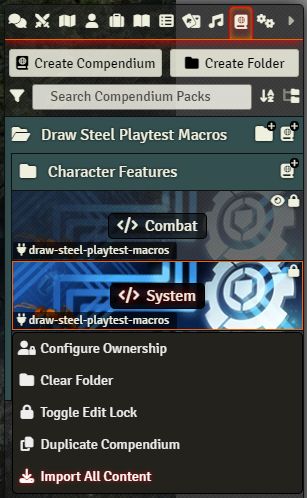
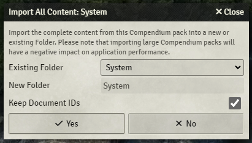
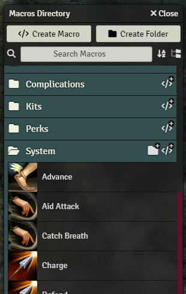
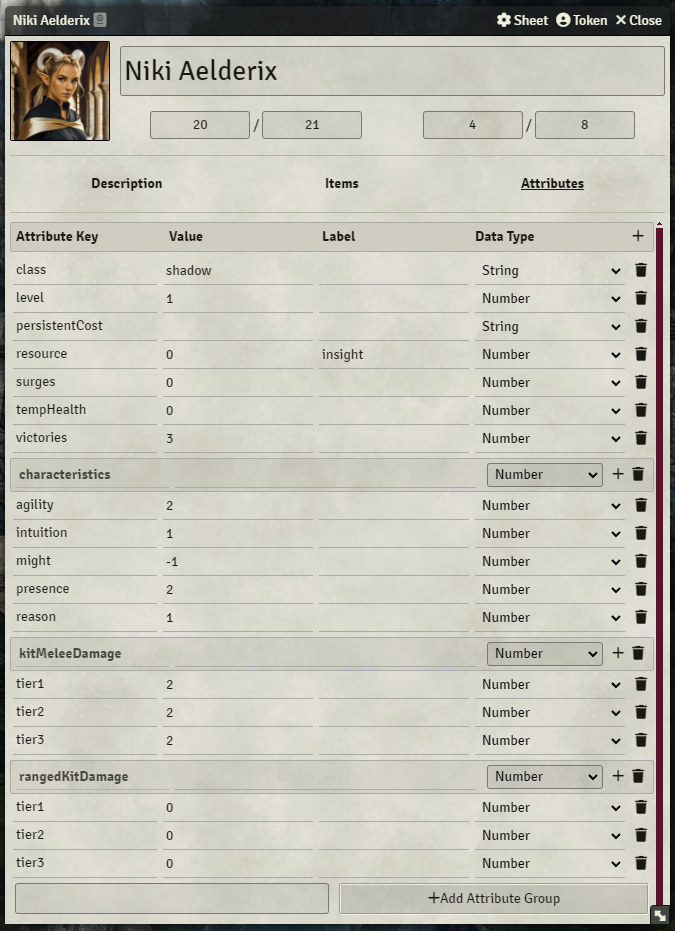
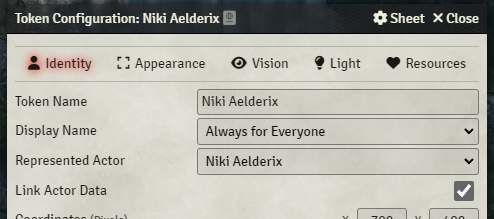

# Draw Steel Playtest Macros

A Foundry VTT module containing several compendiums of macros that can be used for running a playtest game of Draw Steel. These macros allow abilities and features to be sent to the chat with a button that automatically rolls a power roll (for abilities with a power roll), calculates the resulting damage (for abilities that do damage), deduct the resource cost for using the ability (for abilities with a resource cost), and more. Use of surges and abilities with a persistent effect are also implemented.

In addition, the following macros have been implemented for helping during combat (most of which are found in the **Combat** compendium):
- **Roll initiative** - Rolls to determine whether the heroes or enemies start first
- **Start combat** - Updates a player's resource to their current victories
- **Start turn** (found in the compendium for each class) - Prompts for which persistent effects should be maintained and then increases a player's resource based on their class and persistent effects
- **Gain resource** - Increases a player's resource by a specified amount
- **Gain surges** - Increases a player's surges by a specified amount
- **End persistent effect** - Shows a prompt to specify a persistent effect to end
- **Take damage** - Decreases a player's stamina by a specified amount (decreasing temporary stamina first, if it exists)
- **Gain temporary stamina** - Increases a player's temporary stamina by a specified amount
- **Use recovery** - Decreases the player's recoveries and increases the player's stamina by their recovery amount
- **End combat** - Increases a player's victories by a specified amount, and resets their resource, surges, and persistent effects
- **Gain victories** - Increases a player's victories by a specified amount

These macros do not include the comprehensive Draw Steel playtest ruleset. Only the following is currently implemented:
- _Devil_, _Dwarf_, and _Human_ **Ancestry** feats
- _Paragon Censor_, _Green Elementalist_, and _Harlequin Mask Shadow_ **Class** features and abilities
- _Getting Too Old for This_, _Indebted_, and _Shattered Legacy_ **Complications**
- _Swashbuckler_ and _Sword and Board_ **Kits** abilities
- _Charming Liar_, _Homesteader_, and _Wood Wise_ **Perks**
- All common move actions, maneuvers, and actions (in the **System** compendium)

## Setup and Usage

After installing and enabling this module, a set of macro compendiums should appear. To use these macros, they should first be imported by right-clicking on each compendium and selecting "Import All Content".

In the window that appears, ensure you select "Keep Document IDs" so that future imports update the macros rather than creating new ones. Also ensure you select the existing folder if this is not your first time importing the macros.

Once they are imported, you should see them in the Macro Directory (which can be opened by clicking the folder icon to the left of the hotbar). These macros can be dragged from the directory to the hotbar, or into the description of the character sheet.

To use the macros, each actor will need to be configured with the following attributes which are expected by the macros. If you try to use the macros without doing this, you will get errors indicating which which attributes are missing or misconfigured.

    class [String]
    level [Number]
    persistentCost [String]
    resource [Number] - The label must be set to the name of the resource as well
    surges [Number]
    tempHealth [Number]
    victories [Number]
    characteristics [Number group]
    - agility [Number]
    - intuition [Number]
    - might [Number]
    - presence [Number]
    - reason [Number]
    kitMeleeDamage [Number group] - Optional
    - tier1 [Number]
    - tier2 [Number]
    - tier3 [Number]
    rangedKitDamage [Number group] - Optional
    - tier1 [Number]
    - tier2 [Number]
    - tier3 [Number]

Once you've finished setting up the actor, it should look something like the following:

It's also recommended to enable "Link Actor Data" in the token settings for each actor, as the macros will not behave as expected if the token and actor are not linked.

